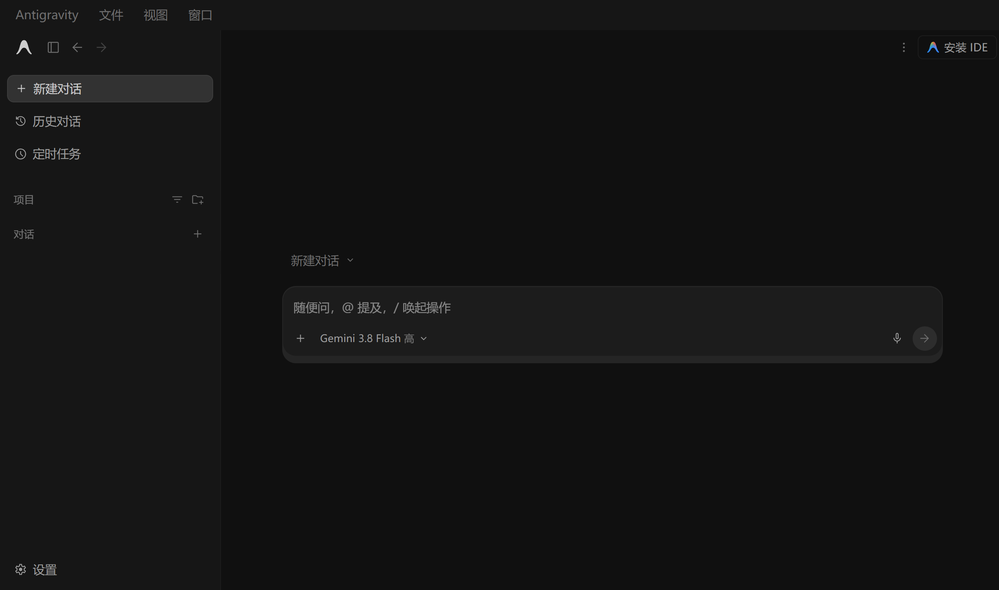

# antigravity-hans

**Simplified Chinese localisation for the [Google Antigravity](https://antigravity.google) desktop app.**

Injected at runtime. **Not a single file inside Antigravity is modified.**

*[中文说明 →](README.md)*

---

## What it looks like



Menus, sidebar, settings panels, permission prompts and run-status labels all come up in Chinese.

1600+ dictionary entries, plus pattern rules for strings that are assembled at runtime.

---

## Why the usual language-pack route doesn't work

Most tutorials you'll find say "install the Chinese language pack via `Ctrl+Shift+X`" or "run `Configure Display Language`".

**Those instructions are for Antigravity IDE** (the VS Code–based product). The Antigravity **desktop app** (`Antigravity.exe`, the "hub" client) is a standalone Electron application — no extension marketplace, no command palette, no `locale.json`, and no i18n machinery anywhere inside `app.asar`. Following those guides gets you nowhere.

This project takes a different route.

---

## How it works

Antigravity starts with `--remote-debugging-port=0`. The actual port is written to:

```
%APPDATA%\Antigravity\DevToolsActivePort
```

From there:

1. Read the port
2. Connect to the renderer over CDP (Chrome DevTools Protocol)
3. Inject a script that walks text nodes with a `TreeWalker`, swaps matches against a dictionary, and attaches a `MutationObserver` to catch React re-renders
4. Re-inject automatically after a page reload

**Nothing in the Antigravity installation directory is touched.** Kill the daemon, reload the window, and the UI is back to English instantly.

---

## Requirements

| | |
|---|---|
| OS | Windows 10 / 11 |
| Antigravity | desktop 2.13.x (older/newer probably fine, not tested exhaustively) |
| Node.js | **not required** — the installer downloads a portable copy if you don't have one |

---

## Install

**Download this repo and double-click `install.bat`.** That's it.

The installer will:

1. Look for Node.js — if there isn't a suitable one, it downloads the current LTS into `runtime\`. Nothing is installed system-wide and PATH is left untouched.
2. Locate `Antigravity.exe` (falling back to reading it out of an existing shortcut)
3. Generate `launcher.vbs`, a windowless launcher
4. **Back up** and repoint the Desktop / Start Menu shortcuts at that launcher

Then just start Antigravity as usual. The UI switches to Chinese a few seconds after the window appears. Your original shortcuts are kept in `backup\`.

> The first run downloads about 30 MB of Node.js. If your network blocks nodejs.org, it will tell you and you can install Node manually.

---

## Usage

**Start** — click the shortcut as usual. The daemon waits for the app to be ready, then injects.

**Turn it off temporarily** — end the `node.exe` process in Task Manager, then press `Ctrl+R` in the Antigravity window.

**Turn it back on** — click the shortcut again.

**Logs** — `src\hans-daemon.log`

---

## Uninstall

Double-click `uninstall.bat`, or:

```powershell
powershell -ExecutionPolicy Bypass -File scripts\uninstall.ps1
```

It stops the daemon, restores the shortcuts from backup, and cleans up generated files.

Since Antigravity itself was never modified, uninstalling leaves you with the stock English UI. Deleting the folder works just as well.

---

## Customising the dictionary

The dictionary is plain JSON — English to Chinese:

```json
{
  "New Conversation": "新建对话",
  "Settings": "设置"
}
```

Edit `src/hans-dict.json` and restart the daemon. It notices the dictionary changed and re-injects on its own — no need to restart Antigravity.

**Strings with variables** go in the `RULES` array in `src/hans-daemon.js` as regexes:

```js
[/^Worked for (.+)$/, "工作 $1"],
[/^Allow running (.+)\?$/, "允许运行 $1？"]
```

**Found something untranslated?** Start the daemon with `--collect` and it will log every English string it failed to match into `src/hans-missed.json`. Note that this also captures your own conversation text, so delete the file when you're done. The collector is off by default.

---

## Known limitations

- **UI copy only.** Your conversation titles, AI replies and code are deliberately left alone.
- **Proper nouns stay English.** `GitHub`, `Gemini`, `MCP`, `yt-dlp` and friends.
- **An Antigravity update can break entries.** If the UI structure changes, some strings stop matching and the dictionary needs topping up.
- **Windows only.** The approach is platform-agnostic (CDP is CDP), but the installer is Windows-only.
- **Native Electron dialogs can't be localised** — those aren't in the page DOM.

---

## Disclaimer

Community project. Not affiliated with, authorised by, or endorsed by Google LLC or the Antigravity team.

It rewrites displayed text at runtime over the debugging protocol. It does **not** modify, repackage or redistribute any part of Antigravity. Even so, evaluate the risk yourself and comply with Antigravity's terms of service.

The dictionary was compiled by the maintainer from the UI's own strings; these are not official translations.

---

## License

[MIT](LICENSE)
